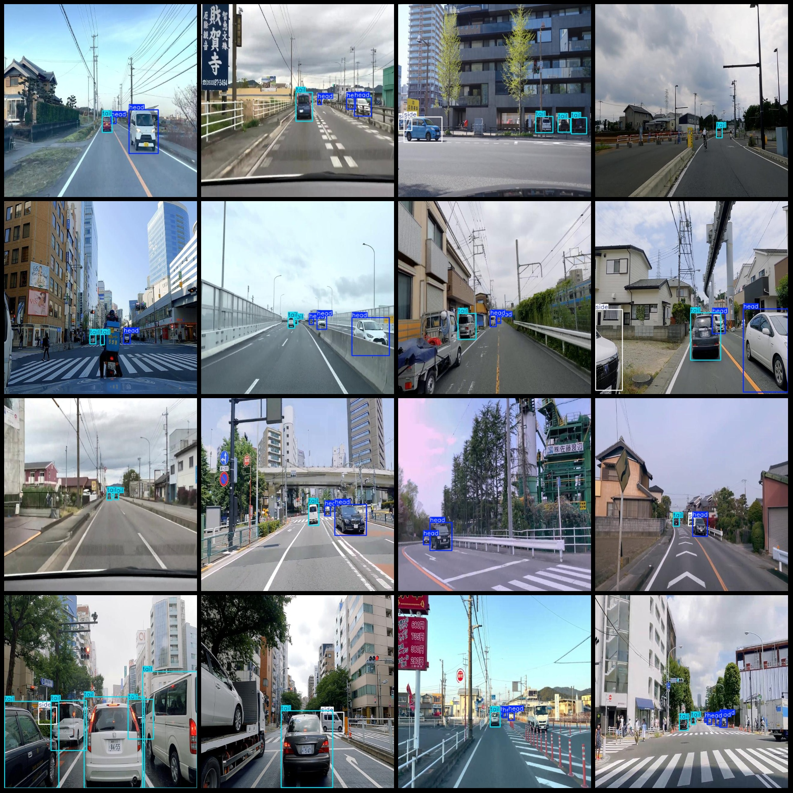
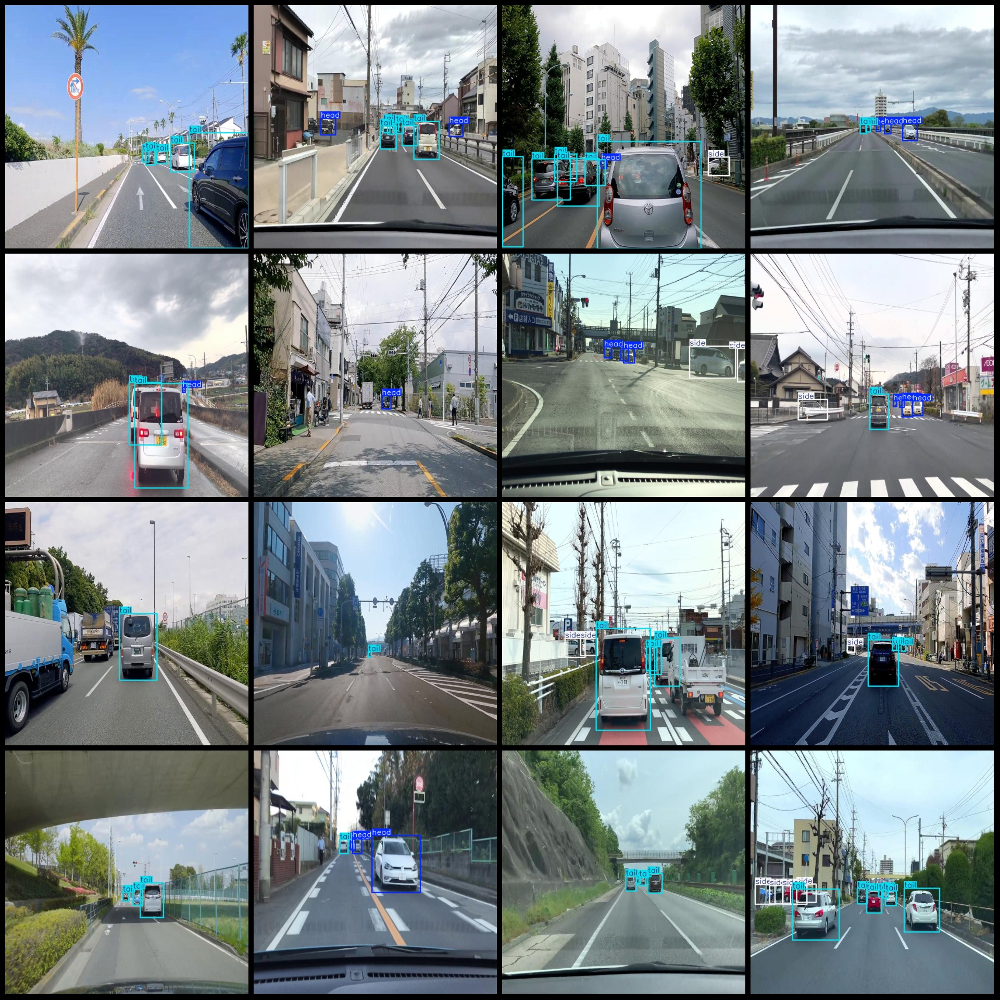

# Intelligent Traffic Head, Tail and Direction Detection Dataset (VOC+YOLO Format) - 5473 Images in 3 Classes

Dataset format: Pascal VOC format + YOLO format (txt file without split path, only containing jpg images along with corresponding VOC format xml files and YOLO format txt files)

Number of images (jpg file count): 5473
Number of annotations (xml file count): 5473
Number of annotations (txt file count): 5473
Number of annotation categories: 3
Annotation category names (note that the order of categories in the YOLO format does not correspond to this, but is based on the labels folder's classes.txt): ["head", "side", "tail"]
Number of bounding box instances for each category:
- head (vehicle head) = 7689
- side (vehicle side) = 3525
- tail (vehicle tail) = 10943
Total bounding boxes: 22157
Image resolution: 640x640
Annotation tool used: labelImg
Annotation rules: draw rectangle boxes for each class
Important note: No guarantees are made regarding the accuracy of the trained models or weight files.
Image preview:

## Images

Here is a pay link on Stripe ( https://buy.stripe.com/3cs8yP7sY87d0vu9AB ). Please contact me lonlonago@foxmail.com after funding $89, and I will send you a complete data files , thank you!

